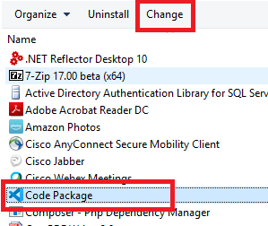
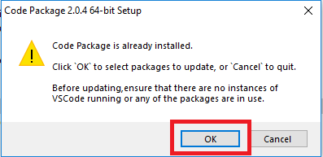
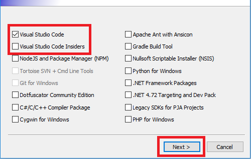

# Bundled Visual Studio Code Development Environment

- [Bundled Visual Studio Code Development Environment](#Bundled-Visual-Studio-Code-Development-Environment)
  - [Description](#Description)
  - [Installing Visual Studio Code Updates](#Installing-Visual-Studio-Code-Updates)
  - [Redistributed Software (included)](#Redistributed-Software-included)
  - [Remote/Downloaded Software (non-redistributed)](#RemoteDownloaded-Software-non-redistributed)

## Description

Bundles several 3rd party libraries and development tools to be used within the Visual Sudio Code IDE.  Install and go!

## Installing Visual Studio Code Updates

This package downloads and installs the latest version VSCode at the time of installation.  This installation uses the standalone installation type with the VSCode ZIP archive.

To update to the latest versions of VSCode, or any other included package that has been updated to a newer version, simply run the "Change..." installation option in the Windows Add/Remove Programs List.

[]

Click OK when prompted to update packages.

[]

Select "Visual Studio Code" for updating before proceeding.

[]

## Redistributed Software (included)

The following software is redistributed locally by code-package:

|Package|Version|License|Required|
|-|-|-|-|-|
|Apache Ant|1.10.5|Apache 2.0|No|
|Ansicon|1.88|Jason Hood|No|
|Dotfuscator|5.26.0|GPL-compatible|No|
|Gradle|5.3.1|GPL|No|
|NodeJS|10.15.3|Node.js|Yes|
|PHP|7.3.5|GPL-compatible|No|
|Python|3.7.3|GPL-compatible|No|
|Tortoise SVN|1.11.1|GPLv2|No|

## Remote/Downloaded Software (non-redistributed)

The following software is not included and is not redistributed locally within code-package, but downloaded inline and installed at the user's discretion:

|Redistributable|Version|Method|License|Required|
|-|-|-|-|-|
|VSCode|Latest|Online|Microsft VSCode|Yes|
|VSCode Extensions|Latest|Online|N/A|Yes|
|.NET Targeting Pack|4.72|Online|Microsoft|No|
|Git for Windows|2.21.0|Online|GPLv2|No|
